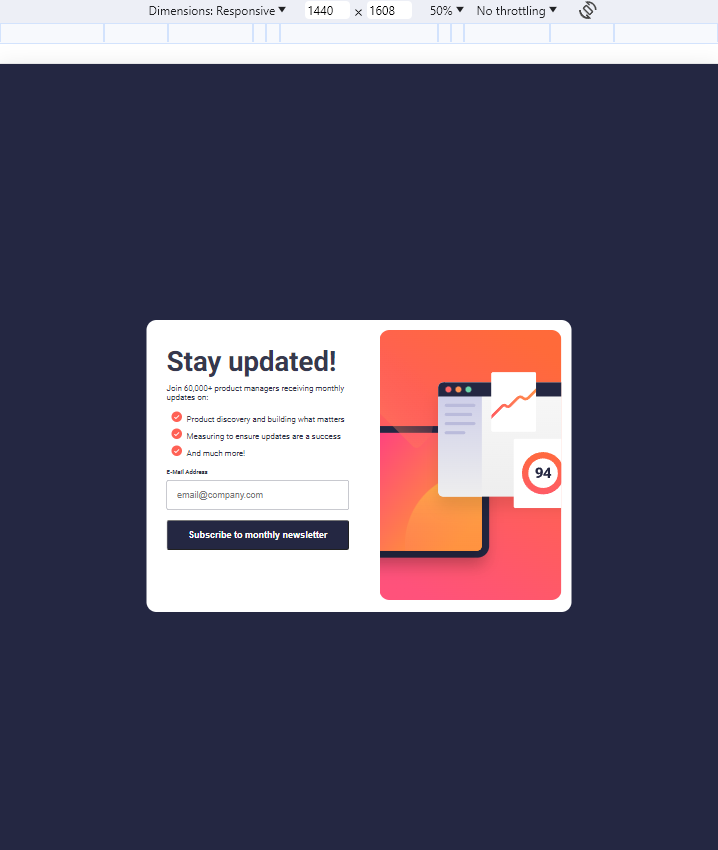
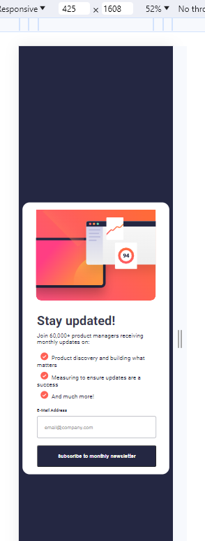

# newsLetterMentor

## Meu processo

### Built with

- Semantic HTML5 markup
- CSS custom properties
- Flexbox
- Mobile-first workflow

## Sofwares utlizados

- HTML
- CSS
- VSCODE
- GIT 

##
## Nota
* Realizei este projeto afim de aperfeiçoar a semântica e a resposividade de meus projetos.
* Estou muito feliz com o resultado, pois consegui superar meus obstáculos.

### Screenshot
## View Desktop

## Laptop

## View Tablet

## View Mobile
